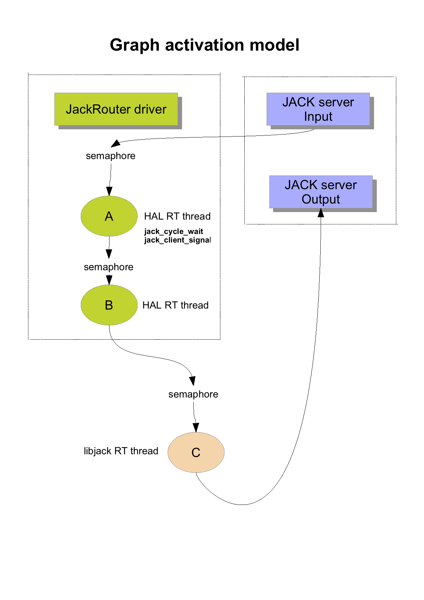

# Design for a JackRouter driver using the AudioServerPlugin model 

### Introduction

The **JackRouter** CoreAudio/JACK bridge was using the **AudioHardwarePlugIn** model, which does not work anymore on recent OSX versions starting on 10.15 Catalina. This document aims to provide some ideas I had  to possibly develop a new version using the  **AudioServerPlugin** model (mail to [Stéphane Letz](mailto: letz@grame.fr)).

### Design 

Design for the **JackRouter** driver using the **AudioServerPlugin** model (see the picture at the end of the document). The point is to allow any mix of CoreAudio/JackRouter running JACK clients with regular JACK clients (that are directly using the JACK API), and **with any kind of graph topology, while preserving synchronous graph activation and no additional latency:**

- the **JACK server** is the daemon process as it is currently designed. It uses a regular CoreAudio driver to receive/send audio buffers, so it is driven by a regular HAL real-time thread (RT). 

- in this example we have a graph of three JACK clients: **A** and **B** will be hosted by the **JackRouter** and **C** is running in a separated application that directly access the JACK API (like Ardour [http://ardour.org](http://ardour.org/) for instance)

- as usual in the JACK model, each client has a RT thread, and each client has an input synchronisation primitive (for instance a mach semaphore). At a given time, the clients are connected to form a graph. The data dependencies in the graph will establish an activation order: at each audio cycle the A client will be activated first by the **JACK Server Input** , then A will run and activate B, then B will run and activate C, then C will run and activate **JACK Server Output**

- the **JackRouter** driver (using the AudioServerPlugin model) is a **coreaudiod** subprocess. It is a unique process that accessed by all CoreAudio clients that will use it (like A and B in this example):

  - the HAL allocates and starts the RT thread for each A and B client. 
  - the  **JACK server Input** HAL audio callback is triggered and copy the input audio buffers to the graph shared memory
  - the RT thread for A would block on A input semaphore, allocated by the JACK client proxy running in the **JackRouter** process. 
  - when A input semaphore is activated by the **JACK server Input**, the audio cycle for A  starts: input buffers from JACK graph (located in shared memory) are copied into the provided buffer. The A IO callback is run, then generated output buffers are copied in the JACK graph. The B input semaphore is signaled to transfer graph activation to B client, and audio cycle for A  is now finished. 
  - same logic for B client, which finally signal the C input semaphore. 
  - when finished, C clients activates the **JACK server** **Output** which copy the output buffers and returns from the HAL audio callback, and the global JACK server cycle is finished.
  - Blocking/resuming a separated thread can be done using JACK non-callback API (see https://jackaudio.org/api/group__NonCallbackAPI.html) in particular **jack_cycle_wait/jack_cycle_signal**  functions. 

-  at each audio cycle, **the JackRouter HAL thread for each client is driven by two activation primitives:** a timer that unlocks the thread at regular interval (the buffer duration) and the JACK input synchronisation primitive. The thread may have to be suspended/resumed twice per cycle. **Could we fake a smaller buffer duration to be sure that the tread is always preferably blocked on the JACK input synchronisation primitive** ?

- C is a regular JACK client that has its own **libjack allocated RT thread**. This RT thread is blocked on C input semaphore, and will resume and do its IO cycle when the C input semaphore is activated. 

- it means the **JackRouter** driver would need to interact with the JACK Server. In the current implementation this is done using: 1) shared memory for the graph connection state and audio buffers 2) shared activation semaphores 3) sockets to implement server/client RPC. 

     

### JACK OSX implementation

The JACK server is using the following specific code on OSX:

- shared mach semaphores: https://github.com/jackaudio/jack2/tree/develop/macosx and https://github.com/jackaudio/jack2/blob/develop/macosx/JackMachSemaphore.mm

- we have server/client RPC code based on **CFMessagePortCreateRemote/CFMessagePortCreateLocal** API that was developed for the JACK iOS port, but not sure this can work. 

- alternatively using the **XPC Services API** is maybe the way to go for server/client RPC:  https://developer.apple.com/library/archive/documentation/MacOSX/Conceptual/BPSystemStartup/Chapters/CreatingXPCServices.html#//apple_ref/doc/uid/10000172i-SW6-SW1 

- shared memory code using POSIX APIs: https://github.com/jackaudio/jack2/blob/develop/common/shm.h, https://github.com/jackaudio/jack2/blob/develop/common/shm.c, https://github.com/jackaudio/jack2/blob/develop/common/JackShmMem.h, https://github.com/jackaudio/jack2/blob/develop/common/JackShmMem.cpp

  

Sockets for server/client communication seems to works, see **CaptainJack** project (check : using PF_INET instead of AF_UNIX), but the server woud have to be launched as a deamon using **launchctl** tool.  Maybe we would need a *sleep mode* for the JACK server where it is lauched as launchctl deamon but still not started as a CoreAudio client ?

### Additional resources

- Background Musice device: https://github.com/kyleneideck/BackgroundMusic
- CoreAudio user-space plug-in driver - sandbox preventing data interaction from another process:
  https://stackoverflow.com/questions/33138275/core-audio-user-space-plug-in-driver-sandbox-preventing-data-interaction-from/36648001#36648001
- Technical Q&A QA181: https://developer.apple.com/library/mac/qa/qa1811/_index.html
- About Daemons and Services: https://developer.apple.com/library/archive/documentation/MacOSX/Conceptual/BPSystemStartup/Chapters/Introduction.html#//apple_ref/doc/uid/10000172i-SW1-SW1
- CoreAudio Developer Forum; https://developer.apple.com/forums/tags/core-audio
- App Sandbox Temporary Exception Entitlements: https://developer.apple.com/library/archive/documentation/Miscellaneous/Reference/EntitlementKeyReference/Chapters/AppSandboxTemporaryExceptionEntitlements.html#//apple_ref/doc/uid/TP40011195-CH5-SW6
- Alternative to bootstrap_register: (https://lists.apple.com/archives/darwin-dev/2009/Nov/msg00060.html)https://lists.apple.com/archives/darwin-dev/2009/Nov/threads.html#00060
- https://stackoverflow.com/questions/27078699/share-unnamed-semaphore-between-processes-in-mac-os
- POSIX semaphore **sem_timedwait.c** (https://github.com/attie/libxbee3/blob/master/xsys_darwin/sem_timedwait.c)
-  Benchmarking message passing and shared memory on macOS: https://blog.antoniofrighetto.com/ipc.html
- Changes to XNU Mach IPC: https://robert.sesek.com/2014/1/changes_to_xnu_mach_ipc.html
- bootstrap_check_in: https://groups.google.com/a/chromium.org/forum/#!topic/chromium-discuss/wns7LkMPdCM
- https://stackoverflow.com/questions/8637206/is-possible-to-use-mac-os-x-xpc-like-ipc-to-exchange-messages-between-processes
- /System/Library/Sandbox/Profiles/com.apple.audio.coreaudiod.sb
